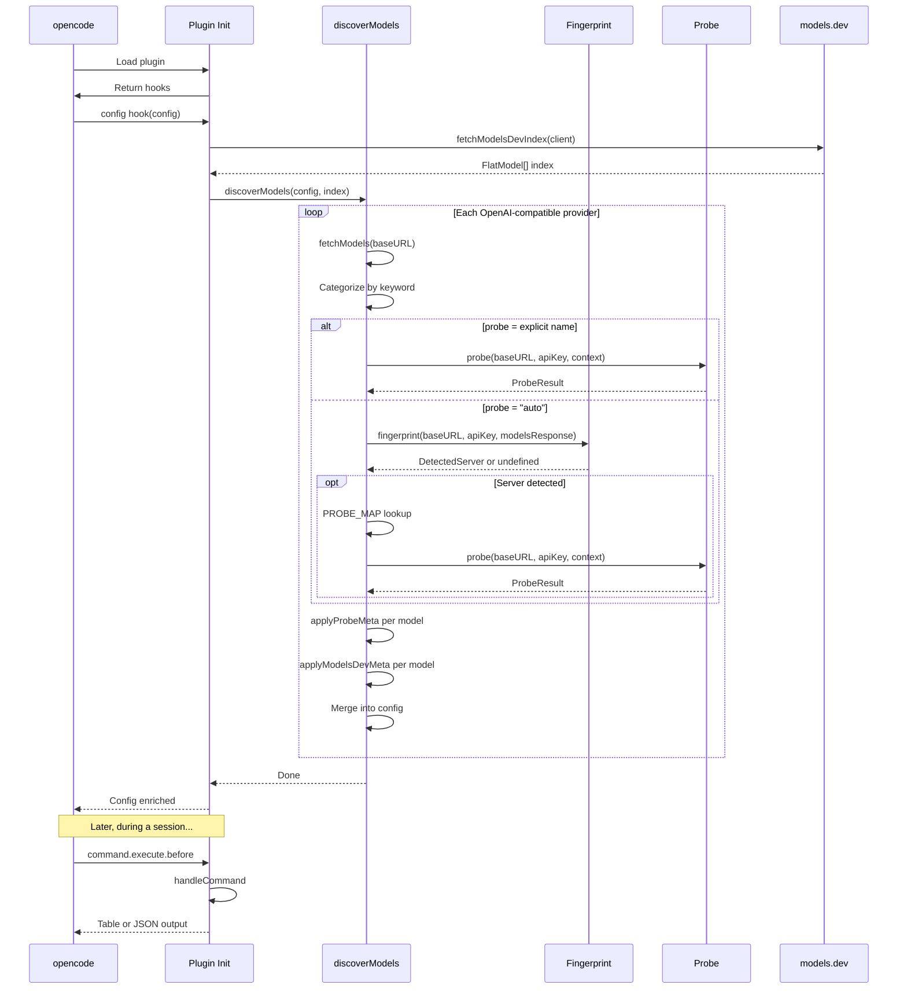
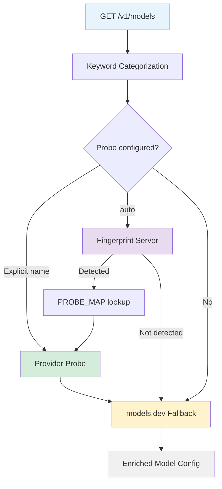
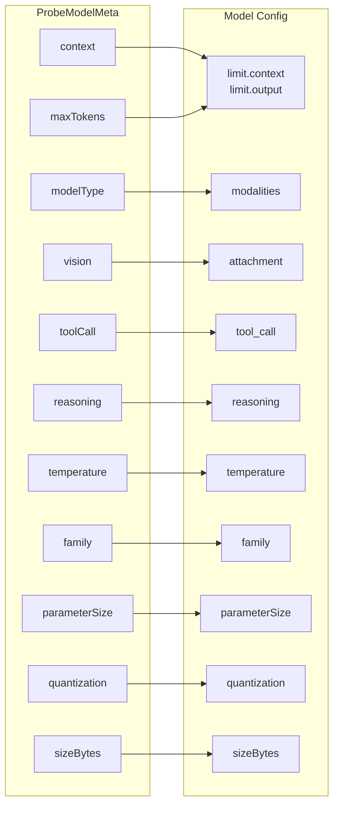
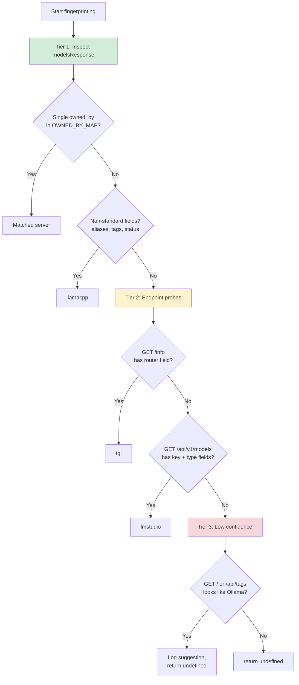
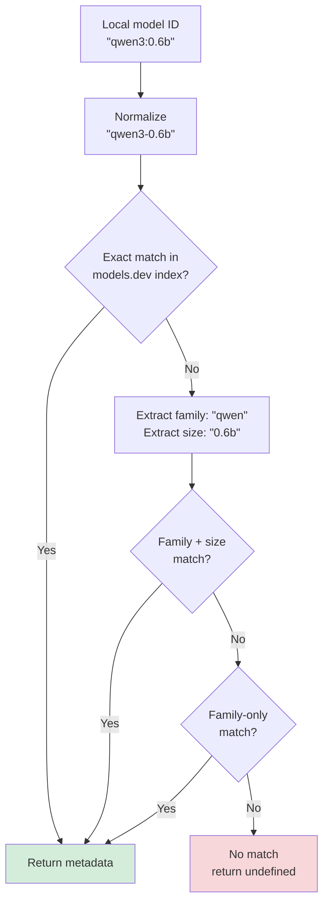

# Contributing to opencode-model-scout

## Architecture Overview

The plugin is structured as a pipeline that runs during opencode's config hook
at startup. The source files are organized into four concerns:

```
src/
├── constants.ts          # Plugin name, log prefix, command name, sentinel
├── index.ts              # Plugin entry point — hook registration
├── discover.ts           # Core discovery engine — the pipeline orchestrator
├── models-dev.ts         # models.dev fallback matching
├── command.ts            # /modelscout slash command handler
├── format.ts             # Model name formatting utilities
└── probes/
    ├── types.ts           # ProbeModelMeta, ProbeResult, ProviderProbe, ProbeContext
    ├── util.ts            # Shared utilities: buildHeaders, probeFetch, EMPTY_RESULT
    ├── index.ts           # Probe registry + resolveProbe (supports "auto")
    ├── fingerprint.ts     # Server auto-detection (tiered fingerprinting)
    ├── omlx.ts            # oMLX probe implementation
    ├── ollama.ts          # Ollama probe implementation
    ├── vllm.ts            # vLLM probe implementation
    ├── tgi.ts             # TGI probe implementation
    ├── sglang.ts          # SGLang probe implementation
    ├── lmstudio.ts        # LM Studio probe implementation
    └── koboldcpp.ts       # KoboldCpp probe implementation
```

### Plugin Lifecycle



### Enrichment Pipeline

Each discovered model passes through three enrichment layers. Each layer only
sets fields that aren't already present — later layers never overwrite earlier
ones, and manually configured models are skipped entirely.



**Layer 1 — Keyword categorization** sets basic model type:

- IDs containing "embed" or "embedding" → categorized as embedding
- IDs matching known LLM family names (qwen, llama, gemma, etc.) → chat
- Everything else → unknown

**Layer 2 — Provider probes** (when `options.probe` is set) call
provider-specific APIs for authoritative metadata:

- Context window and output limit
- Model type (LLM/VLM/embedding)
- Capability flags (tools, vision, reasoning)
- Physical metadata (parameter size, quantization, disk size)

When `"probe": "auto"` is set, the plugin fingerprints the server first
(see [Server Auto-Detection](#server-auto-detection)) and maps the detected
server to its probe via `PROBE_MAP`.

**Layer 3 — models.dev fallback** matches model IDs against opencode's built-in
database of ~4,000 cloud models to infer capabilities:

- Only applies capability flags (tool_call, reasoning, attachment, etc.)
- Does NOT apply context/output limits (these vary by quantization/provider)
- Uses 3-tier matching: exact → family+size → family-only

### Data Flow Through `applyProbeMeta`

When a probe returns metadata, `applyProbeMeta()` maps probe fields to opencode
config fields with specific precedence rules:



Key rules:

- `limit` is only set if the model doesn't already have one
- VLM model type → `modalities: { input: ["text", "image"], output: ["text"] }`
  - `attachment: true`
- LLM model type → `modalities: { input: ["text"], output: ["text"] }`
- Capability flags (`tool_call`, `reasoning`, `temperature`) are only set if
  the model doesn't already have them
- Capability flags are only ever set to `true`, never `false` — unknown is
  better than wrong

### Server Auto-Detection

When `"probe": "auto"` is configured, the `fingerprint()` function in
`src/probes/fingerprint.ts` identifies the server using a tiered strategy:



**Tier 1 -- modelsResponse inspection** (free, no HTTP):

- Checks `owned_by` against `OWNED_BY_MAP` (omlx, vllm, sglang, llamacpp, koboldcpp, library→ollama)
- If `owned_by` is unknown or mixed, checks for non-standard fields (`aliases`, `tags`, `status`) that indicate llama.cpp

**Tier 2 -- endpoint probes** (sequential HTTP, 2s global timeout):

- `GET /info` with a `router` field → TGI
- `GET /api/v1/models` with `key` + `type` fields → LM Studio

**Tier 3 -- low confidence** (suggestion only):

- `GET /` containing "Ollama is running" or `/api/tags` responding with model list → logs a suggestion to set `"probe": "ollama"` explicitly, returns `undefined`

Once detected, `PROBE_MAP` maps the server to its probe implementation:

| Detected Server | Probe Used |
| --------------- | ---------- |
| ollama          | ollama     |
| llamacpp        | ollama     |
| omlx            | omlx       |
| lmstudio        | lmstudio   |
| tgi             | tgi        |
| sglang          | sglang     |
| vllm            | vllm       |
| koboldcpp       | koboldcpp  |

Note that llama.cpp maps to the `ollama` probe because llama.cpp's HTTP server
implements an Ollama-compatible API.

## Building a New Probe

Probes are the most impactful way to contribute. If you run a local inference
server that has a metadata API, you can write a probe for it.

### Probe Contract

Every probe must implement the `ProviderProbe` type signature:

```typescript
type ProviderProbe = (
  baseURL: string, // Normalized, no trailing /v1
  apiKey?: string, // From provider options
  context?: ProbeContext, // Pre-fetched data from the discovery layer
) => Promise<ProbeResult>;

interface ProbeContext {
  /** Pre-fetched /v1/models entries, for probes that need them */
  modelsResponse?: OpenAIModelEntry[];
}

interface ProbeResult {
  models: Record<string, ProbeModelMeta>;
}
```

The `context` parameter provides data already fetched by the discovery layer.
Probes can read `context.modelsResponse` to access the `/v1/models` entries
without making a redundant HTTP call. This is especially useful for probes like
vLLM and SGLang where the models response already contains non-standard fields
(e.g., `max_model_len`) with useful metadata.

Probes must follow these rules:

1. **Use `probeFetch()`** from `./util` for all HTTP calls — it handles
   timeout (2s default) and abort signal composition automatically
2. **Never throw** — catch all errors and return `EMPTY_RESULT` from `./util`
   on failure
3. **Log warnings** using `LOG_PREFIX` from constants when things go wrong
4. **Only set capability flags to `true`** — don't set `false` for unknown
   capabilities (leave them undefined)

### Step-by-Step

1. Create `src/probes/yourprovider.ts`:

```typescript
import type {
  ProbeModelMeta,
  ProbeResult,
  ProbeContext,
  ProviderProbe,
} from "./types";
import { LOG_PREFIX } from "../constants";
import { buildHeaders, probeFetch, EMPTY_RESULT } from "./util";

export const probeYourProvider: ProviderProbe = async (
  baseURL: string,
  apiKey?: string,
  context?: ProbeContext,
): Promise<ProbeResult> => {
  try {
    // Option A: Use context.modelsResponse if the /v1/models response
    // already contains the metadata you need (e.g., max_model_len)
    if (context?.modelsResponse) {
      const models: Record<string, ProbeModelMeta> = {};
      for (const entry of context.modelsResponse) {
        models[entry.id] = {
          context: (entry as Record<string, unknown>).context_window as
            | number
            | undefined,
          temperature: true,
        };
      }
      return { models };
    }

    // Option B: Call a provider-specific metadata API
    const headers = buildHeaders(apiKey);
    const res = await probeFetch(`${baseURL}/your/metadata/endpoint`, {
      headers,
    });

    if (!res) return EMPTY_RESULT;
    if (!res.ok) {
      console.warn(`${LOG_PREFIX} YourProvider probe: HTTP ${res.status}`);
      return EMPTY_RESULT;
    }

    const data = await res.json();
    const models: Record<string, ProbeModelMeta> = {};

    // Map response to ProbeModelMeta per model
    for (const entry of data.models ?? []) {
      models[entry.id] = {
        context: entry.context_window,
        maxTokens: entry.max_output,
        modelType: entry.supports_vision ? "vlm" : "llm",
        vision: entry.supports_vision ? true : undefined,
        toolCall: entry.supports_tools ? true : undefined,
        temperature: true,
      };
    }

    return { models };
  } catch (error) {
    console.warn(`${LOG_PREFIX} YourProvider probe failed:`, error);
    return EMPTY_RESULT;
  }
};
```

2. Register it in `src/probes/index.ts`:

```typescript
import { probeYourProvider } from "./yourprovider";

const PROBES: Record<string, ProviderProbe> = {
  omlx: probeOmlx,
  ollama: probeOllama,
  yourprovider: probeYourProvider, // Add this line
};
```

3. Write tests in `test/probes/yourprovider.test.ts` — mock `global.fetch`,
   test success path, error handling, and edge cases. See
   `test/probes/omlx.test.ts` for a template.

4. Update the README probe documentation.

### ProbeModelMeta Fields

All fields are optional. Set what your provider can report:

| Field           | Type                            | Description                           |
| --------------- | ------------------------------- | ------------------------------------- |
| `context`       | `number`                        | Context window in tokens              |
| `maxTokens`     | `number`                        | Maximum output tokens                 |
| `modelType`     | `"llm" \| "vlm" \| "embedding"` | Model classification                  |
| `toolCall`      | `boolean`                       | Supports function/tool calling        |
| `reasoning`     | `boolean`                       | Supports extended thinking mode       |
| `temperature`   | `boolean`                       | Supports temperature parameter        |
| `vision`        | `boolean`                       | Supports image input                  |
| `loaded`        | `boolean`                       | Currently loaded in memory            |
| `sizeBytes`     | `number`                        | Model file size on disk               |
| `parameterSize` | `string`                        | Human-readable param count ("30.5B")  |
| `family`        | `string`                        | Model family ("qwen3", "llama")       |
| `quantization`  | `string`                        | Quantization level ("Q4_K_M", "4bit") |

### What Makes a Good Probe

- **Fast** — complete in under 2 seconds even with many models
- **Parallel** — if per-model calls are needed (like Ollama's `/api/show`),
  use `Promise.allSettled()` to call them concurrently
- **Resilient** — partial failures should not prevent other models from being
  enriched. If one model's metadata call fails, the others should still work.
- **Accurate** — only report what the provider API confirms. Don't guess
  capabilities that aren't explicitly reported.

## Adding New Server Fingerprints

If you're adding support for a new server type that should be auto-detected
via `"probe": "auto"`, you need to update three things in
`src/probes/fingerprint.ts`:

### 1. Add to `OWNED_BY_MAP` (Tier 1)

If the server sets a distinctive `owned_by` value in its `/v1/models` response,
add it to the map for free detection with no HTTP overhead:

```typescript
const OWNED_BY_MAP: Record<string, DetectedServer> = {
  omlx: "omlx",
  vllm: "vllm",
  // ...
  yourserver: "yourserver", // Add this line
};
```

### 2. Add a Tier 2 endpoint probe (if needed)

If the server cannot be identified by `owned_by` alone, add a Tier 2 check
that probes a server-specific endpoint. Add it to the sequential probe chain
in the `fingerprint()` function, before the Tier 3 section:

```typescript
// Step N: GET /your/unique/endpoint → YourServer
try {
  const res = await probeFetch(`${baseURL}/your/unique/endpoint`, {
    headers,
    signal: combinedSignal,
    timeoutMs: 1000,
  });
  if (res?.ok) {
    const data = (await res.json()) as Record<string, unknown>;
    if (/* response shape is unique to this server */) {
      return "yourserver";
    }
  }
} catch {
  // JSON parse failure — continue
}
```

### 3. Update `PROBE_MAP`

Map the detected server to the probe implementation that should handle it:

```typescript
export const PROBE_MAP: Record<DetectedServer, ProbeKey> = {
  // ...
  yourserver: "yourserver", // Maps to the probe registered in PROBES
};
```

If the new server is API-compatible with an existing probe (like llama.cpp
using the ollama probe), map it to the existing probe key instead.

### 4. Update types

Add the new server name to both the `DetectedServer` and `ProbeKey` union
types (if it uses its own probe) at the top of `fingerprint.ts`.

## models.dev Matching

The `src/models-dev.ts` module handles fallback enrichment when no probe is
available. Understanding its matching logic is important if you're debugging
why a model did or didn't get capabilities applied.

### Matching Strategy



**Normalization** strips the owner prefix (`qwen/qwen3-30b` → `qwen3-30b`),
replaces `:` with `-`, and lowercases.

**Family extraction** takes the leading alphabetic characters: `qwen3` →
`qwen`, `deepseek-r1` → `deepseek`, `llama-3.2` → `llama`.

**Size extraction** finds the first number+suffix pattern: `qwen3:0.6b` →
`0.6b`, `qwen3-30b-a3b` → `30b`. Size matching uses word boundaries to
prevent `4b` from matching inside `14b`.

### What models.dev Applies

Only capability flags — never limits:

| Applied       | NOT applied     |
| ------------- | --------------- |
| `tool_call`   | `limit.context` |
| `reasoning`   | `limit.output`  |
| `attachment`  | `cost`          |
| `temperature` |                 |
| `family`      |                 |
| `modalities`  |                 |

Context and output limits vary dramatically by quantization level and provider,
so they can only come from probes.

## Development

### Prerequisites

- Node.js 22+
- npm

### Setup

```bash
git clone https://github.com/rmk40/opencode-model-scout.git
cd opencode-model-scout
npm install
```

### Commands

```bash
npm run check        # typecheck + lint + format:check + test (CI gate)
npm run fix          # eslint --fix + prettier --write (auto-fix everything)
npm run lint         # ESLint only
npm run lint:fix     # ESLint with auto-fix
npm run format       # Prettier write
npm run format:check # Prettier check only
npm run typecheck    # TypeScript type checking only
npm run test:run     # Run tests once
npm run test         # Run tests in watch mode
npm run compile      # Build dist/ via tsup
npm run build        # check + compile (full validation + build)
```

### Git Hooks

Husky hooks run automatically:

- **pre-commit** — `lint-staged` runs ESLint --fix and Prettier on staged files
- **pre-push** — `npm run check` (full validation gate)

### Testing

Tests use [vitest](https://vitest.dev/) with `globals: true`. All network
calls are mocked via `vi.fn()` on `global.fetch`.

```bash
# Run a specific test file
npx vitest run test/probes/omlx.test.ts

# Run with coverage
npm run test:coverage
```

### Testing Against Live Providers

If you have oMLX or Ollama running locally, you can verify probe output
manually:

```bash
# oMLX (requires auth)
curl -s http://localhost:8000/v1/models/status \
  -H "Authorization: Bearer your-key" | jq .

# Ollama — list models
curl -s http://localhost:11434/api/tags | jq .

# Ollama — show model details
curl -s http://localhost:11434/api/show \
  -d '{"model":"qwen3:0.6b"}' | jq .
```

### Project Structure

```
opencode-model-scout/
├── src/
│   ├── constants.ts       # Single source of truth for all naming strings
│   ├── index.ts            # Plugin entry — hooks only, no logic
│   ├── discover.ts         # Pipeline orchestrator (largest file)
│   ├── models-dev.ts       # models.dev index + matching
│   ├── command.ts          # /modelscout output formatting
│   ├── format.ts           # Model name prettification
│   └── probes/
│       ├── types.ts         # Shared types (ProbeModelMeta, ProbeContext)
│       ├── util.ts          # Shared probe utilities
│       ├── index.ts         # Registry + resolveProbe (supports "auto")
│       ├── fingerprint.ts   # Server auto-detection (tiered)
│       ├── omlx.ts          # oMLX probe
│       ├── ollama.ts        # Ollama probe
│       ├── vllm.ts          # vLLM probe
│       ├── tgi.ts           # TGI probe
│       ├── sglang.ts        # SGLang probe
│       ├── lmstudio.ts      # LM Studio probe
│       └── koboldcpp.ts     # KoboldCpp probe
├── test/
│   ├── probes/
│   │   ├── omlx.test.ts
│   │   ├── ollama.test.ts
│   │   ├── fingerprint.test.ts
│   │   ├── vllm.test.ts
│   │   ├── tgi.test.ts
│   │   ├── sglang.test.ts
│   │   ├── lmstudio.test.ts
│   │   ├── koboldcpp.test.ts
│   │   └── util.test.ts
│   ├── discover.test.ts
│   ├── command.test.ts
│   ├── format.test.ts
│   └── models-dev.test.ts
├── package.json
├── tsconfig.json
├── vitest.config.ts
├── eslint.config.js
├── .prettierignore
├── .husky/
│   ├── pre-commit
│   └── pre-push
├── .github/workflows/
│   ├── release.yml          # Tag → check + compile + npm publish + GitHub Release
│   └── latest.yml           # Main push → check + rolling snapshot release
├── AGENTS.md
├── README.md
├── CONTRIBUTING.md
└── LICENSE
```

### Naming Convention

All user-visible strings (plugin name, log prefix, command name, sentinel) are
defined in `src/constants.ts`. If the plugin needs to be renamed, only that
file changes:

```typescript
export const PLUGIN_NAME = "opencode-model-scout";
export const LOG_PREFIX = `[${PLUGIN_NAME}]`;
export const COMMAND_NAME = "modelscout";
export const COMMAND_TEMPLATE = `/${COMMAND_NAME}`;
export const COMMAND_SENTINEL = `__${COMMAND_NAME.toUpperCase()}_COMMAND_HANDLED__`;
```

### Commit Style

This project uses [Conventional Commits](https://www.conventionalcommits.org/):

```
feat: add LM Studio probe
fix: size matching false-positive on 4b/14b
docs: update probe comparison table
test: add coverage for empty model list
```
